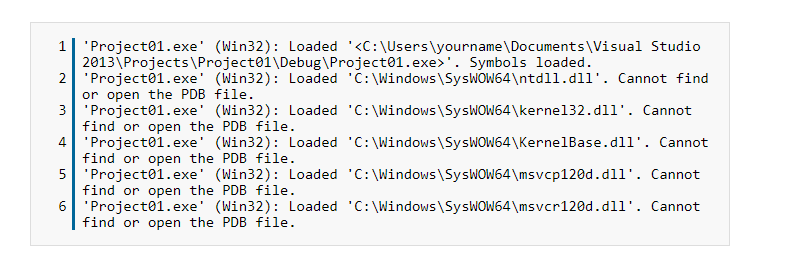
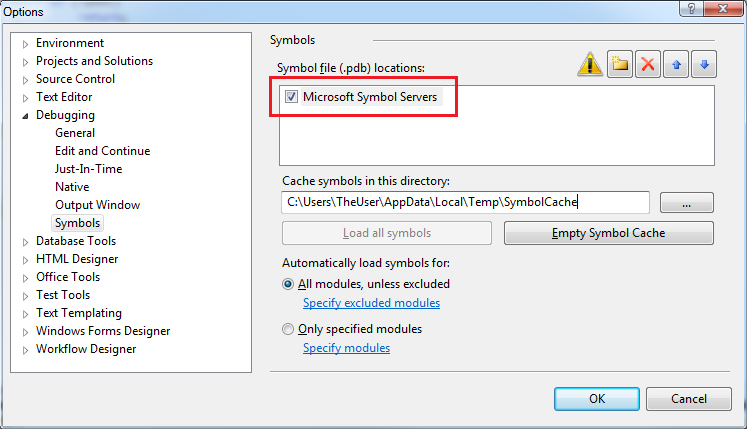
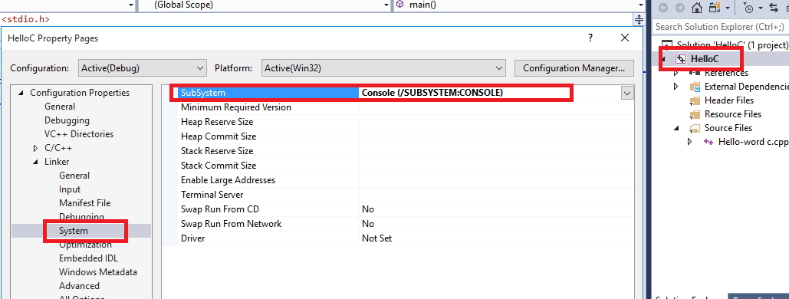
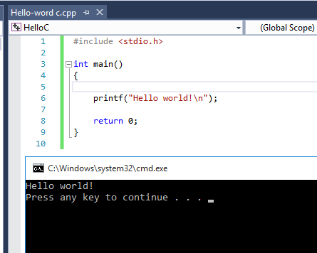

<strong># glfw-set</strong>

the target of this work is to fix error faces you when tring to create a new empty project in vs 2017 and run glfw code in it.

 if you tried this video: <a href="https://www.youtube.com/watch?v=k9LDF016_1A&amp;feature=share">https://www.youtube.com/watch?v=k9LDF016_1A&amp;feature=share</a>

and it's not working try the following

if you tried to add a glfw work before delete all glfw files in this directory  C:\Program Files (x86)\Microsoft Visual Studio\2017\Community\VC\Auxiliary\VS\include

then take this link to download glfw precompiled binary for win 32  https://github.com/glfw/glfw/releases/download/3.2.1/glfw-3.2.1.bin.WIN32.zip

the file will download library and include files

&nbsp;

add include file in vs include directory&nbsp;

add lib file in vs lib directory&nbsp;

add glfw3.dll in system32

the same for glad except you have to download your own version depending on your graphic card opengl value 
https://glad.dav1d.de/

you can check this on your graphic card vendor website 

&nbsp;

in the new created empty project do the following :

1- create new .cpp file and copy the following file code in&nbsp;

<a href="https://learnopengl.com/code_viewer_gh.php?code=src/1.getting_started/2.1.hello_triangle/hello_triangle.cpp">https://learnopengl.com/code_viewer_gh.php?code=src/1.getting_started/2.1.hello_triangle/hello_triangle.cpp</a>

2- add glad.c file to your project directory&nbsp;

// to get project directory RC the project in vs2017 and choose open folder in file explorer&nbsp;

3- RC project source in vs2017 project ---&gt; add --&gt; exiciting item ---&gt; will open navigation window ---&gt; glad.c

4- in project properties :

linker --&gt; input --&gt; additional depedencies ---&gt; glfw3.lib , opengl32.lib

5- tools ---&gt; options ---&gt; depugging --&gt; symbols -- &gt; check "microsoft symbol server"

try to run

&nbsp;

 Errors fix visual studio 2017

   1- Can&rsquo;t open pdb file 

Go to Tools-&gt;Options-&gt;Debugging-&gt;Symbols

 2- Screen disappears  Right click on your project-&gt; Properties-&gt;Configuration Properties-&gt; Linker-&gt; System, select Console (/SUBSYSTEM:CONSOLE) in SubSystem option.
  
  

  After this, press Ctrl+F5 then by default it prompts your to press return to close the window. If you want to use the debugger, you should put a breakpoint on the last line.  

Configuration ----- release or ctrl + f5

